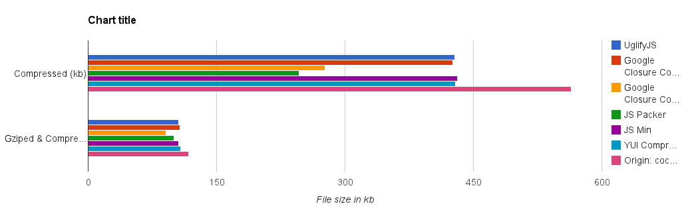
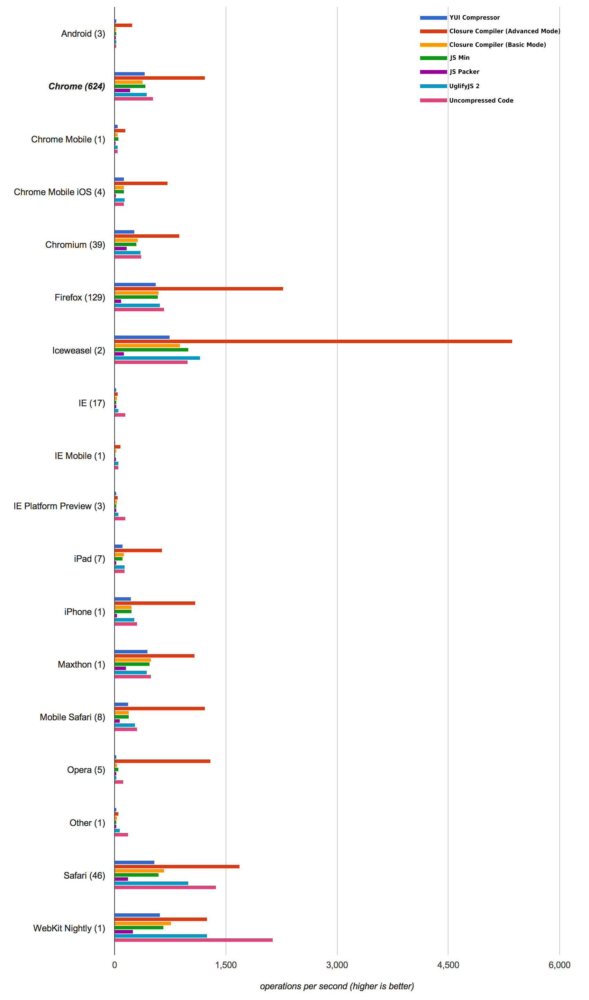
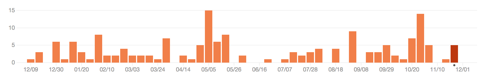
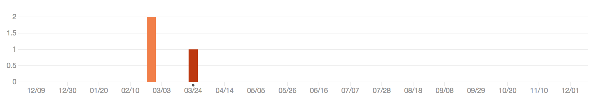
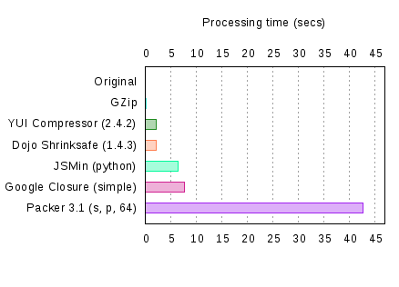

Javascript压缩混淆工具比较分析
==============================
_2013年11月29号 凌华彬 - Cocos2d-HTML5引擎组_

1. 主流压缩工具 
-----

* [UglifyJS](https://github.com/mishoo/UglifyJS)

* [Google Closure Compiler](https://developers.google.com/closure/compiler/)

* [Dean Edwards' JS Packer](http://dean.edwards.name/packer/)

* [Douglas Crawford's JS Min](http://fmarcia.info/jsmin/test.html)

* [YUI Compressor](http://refresh-sf.com/yui/)

2. 压缩比
-----

我使用上述压缩工具压缩了我们的精简版cocos.js，并对每个压缩文件进行了gzip压缩，从上图可以看出，压缩大小上JS Packer和Google Closure Compiler的Advanced模式有较大优势，其他压缩工具没有明显差距。考虑到我们极尽全力压缩js文件是为了获得更好的网络加载速度，而js文件都是gzip压缩后通过网络发送，所以我另外测试gzip压缩后大小。Closure Compiler依然是最小的，只有91kb，但是优势并不明显，其他工具压缩+gzip后文件大小都在100-110之间，而源文件gzip压缩后也只有117kb。

详细的数据参见：[GDoc](https://docs.google.com/a/cocos2d-x.org/spreadsheet/ccc?key=0AlqDuyWvmncKdDcyeU1YMS1taDdGMVVVZUpPMnVpWWc#gid=0)

3. 压缩后代码运行效率
-----

很难得找到了[DWR引擎](http://directwebremoting.org/dwr/documentation/browser/engine/index.html)在不同压缩方式下的运行效率比较：

[来源](http://jsperf.com/testing-code-performance-by-compression-type) 
[结果数据](http://www.browserscope.org/user/tests/table/agt1YS1wcm9maWxlcnINCxIEVGVzdBiuyPASDA)

结果很明显，Google Closure Compiler在Advanced模式下运行效率优势非常明显，UglifyJS在大多数情况下要略优于其他压缩方式，但优势非常有限。除此之外，JS Packer压缩后代码虽然拥有最高的压缩比，但是效率却最低，这和JS Packer独特的压缩逻辑有很大关系。 
同时郑晓俊观察到了非常值得挖掘的一点：未压缩代码在绝大多数情况下运行效率居然优于压缩过代码（除了Closure Compiler Advanced Mode）。 
另一个问题是，这项测试是基于DWR引擎代码的，DWR引擎是主要用于网络通讯的一个javascript引擎，和游戏引擎的差别非常大。鉴于这两点，有必要为Cocos2d-HTML5引擎专门写一个测试用例来测试不同压缩方式对Cocos2d代码运行效率的影响。

> _TODO: Cocos2d-HTML5引擎代码运行效率测试用例以及测试结果_

4. 一些重要的细节
-----

####4.1 基本信息和维护状况

* UglifyJS: 
> 开发语言：Javascript 
> Github页面：https://github.com/mishoo/UglifyJS2 
> 维护状况： 
> 维护热度非常高，也是目前最流行的Javascript压缩工具。

* Closure Compiler
> 开发语言：JAVA 
> Google Code页面：https://code.google.com/p/closure-compiler/ 
> 维护状况：和UglifyJS一样热度非常高。

* YUI Compressor
> 开发语言：JAVA 
> Github页面：https://github.com/yui/yuicompressor 
> 维护状况： 

* JS Packer
> 开发语言：PHP，Perl... 
> 维护状况：停止维护，不同平台版本由不同开发者移植。

* JS Min
> 开发语言：C 
> Github页面：https://github.com/douglascrockford/JSMin 
> 维护状况： 

####4.2 压缩算法安全性

尽管上面的测试现实Closure Compiler的Advanced Mode在代码运行效率上有非常明显的优势，但是Advanced Mode最为人诟病的是其对代码暴力的修改方式经常会造成用户代码不可用，在更严重的情况下，它会给用户代码留下一些很难被检测的BUG。所以使用Closure Compiler Advanced Mode需要开发人员熟悉其压缩逻辑，避免写出致错的代码，这往往不是那么容易做到，属于较难控制的风险。

相对来说，Closure Compiler Basic Mode,YUI Compressor，UglifyJS和JS Min都比Closure Compiler Advanced Mode安全得多，他们在压缩逻辑上保证了压缩的安全性。

鉴于JS Packer拥有很独特的压缩逻辑，同时它的用户数量非常有限，也可能会有一些安全隐患。

####4.3 条件编译能力

UglifyJS拥有最好的条件编译能力

>ex：只需要在代码中使用下面形式编写DEBUG代码 
>
	if (DEBUG) {
	   	console.log("debug stuff");
	}
>在编译时传入命令：`--define DEBUG=false`就可以将DEBUG代码自动去除。

Closure Compiler没有原生条件编译支持，但是可以通过一些方式实现：

>ex：在代码中使用如下形式编写DEBUG代码 
>
	/** @define {boolean} */
	var DEBUG = true;
	if(DEBUG) {
    	console.log("debug stuff");
	}
>然后在编译时传入命令：`--define='DEBUG=false'`可以将`DEBUG`变量值变为false，紧接其后的代码就会自动被去除。但是需要注意的是，所有DEBUG代码段之前，`/** @define {boolean} */ var DEBUG = true;`不可以被省略，并且`var DEBUG = true;`编译后并不会被去除。

其他的压缩工具并不具有条件编译能力。

####4.4 自动化压缩脚本

UglifyJS 2已经使用npm来管理，所以植入我们的编译过程是最方便直接的，郑晓俊已经实现这部分代码。

Closure Compiler和YUI Compressor是JAVA程序，编译时必须提前拷贝对应的jar程序到项目目录下。

JS Min和JS Packer都可以编译为命令行版本，不过也同样需要被包含再项目目录下才能实现自动化压缩。

对于部分工具比如Closure Compiler，也可以在编译时访问它的WEB API来进行压缩，不过由于访问时间过于长，这种方案并不提倡。

5. 压缩过程耗时
-----

_来源：http://www.alittlemadness.com/2010/06/03/javascript-compressor-comparison/_

压缩过程耗时并不算是很重要的考量标准，因为只有开发者需要忍受这段时间，所以放到最后。在图中并没有UglifyJS，不过从其他来源可以知道，UglifyJS的压缩时间是非常快的，和YUI Compressor属于同一个级别，有些情况下甚至更快。

6. 附：Closure Compiler对于未使用代码的处理
-----

Closure Compiler对于部分未使用代码可以很智能得在压缩时将它们剔除，尤其是Advanced Mode中这点尤为明显。但是当Cocos2d-HTML的内部模块未被用户使用时，Glosure Compiler却无法做到将它们剔除。主要原因在于Cocos2d-HTML的内部对象组织方式。

ex:

	cc = {};
	
	cc.PARTICLE_DEFAULT_CAPACITY = 500;

	cc.ParticleBatchNode = cc.Node.extend({
		...
	});
	
这种情况下，即便ParticleBatchNode从未被使用，这部分代码也将被保留在压缩后版本中，不论Basic Mode还是Advanced Mode。这是因为cc是全局变量，而Closure Compiler是不会剔除全局变量以及其属性或方法的。Closure Compiler根据依赖判定来去除代码主要还是局限在较小的scope中。

不过这不重要，由于Cocos2d-HTML5将使用npm来管理项目，我们的子模块也会被分割出来，那么用户完全可以根据自己的需求来选择需要的模块或第三方程序包，不需要压缩工具来越俎代庖。
